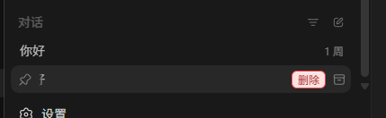
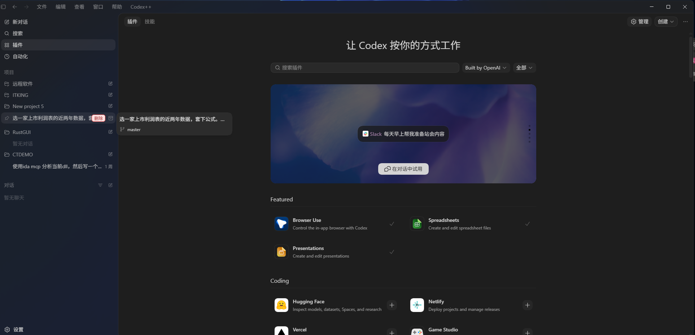

# Claude Codex Pro Tool

<p align="center">
  
</p>

<p align="center">
  中文 | <a href="README_EN.md">English</a>
</p>

<p align="center">
  
  
  
  
  
</p>

Claude Codex Pro Tool 是面向 Codex App 的外部增强启动器和管理工具。它不修改 Codex App 原始安装文件，而是通过外部 launcher 启动 Codex，并使用 Chromium DevTools Protocol 注入增强脚本。

## 快速开始

从 [GitHub Releases](https://github.com/DamonZS/Claude-Codex-Pro-Tool/releases) 下载最新安装包：

- Windows：`claude-codex-pro-plus-*-windows-x64-setup.exe`
- macOS Intel：`claude-codex-pro-plus-*-macos-x64.dmg`
- macOS Apple Silicon：`claude-codex-pro-plus-*-macos-arm64.dmg`

安装后会有两个入口：

- `Claude Codex Pro`：静默启动入口，只负责启动 Codex 并注入增强功能。
- `Claude Codex Pro 管理工具`：Tauri 控制面板，用于启动、诊断、修复、更新、配置中转注入、管理增强功能和用户脚本。

Windows 安装包会创建桌面和开始菜单快捷方式。macOS DMG 会安装 `/Applications/Claude Codex Pro.app` 和 `/Applications/Claude Codex Pro 管理工具.app`。

## 主要功能

- Rust 后端和静默 launcher，启动时不依赖额外运行时。
- Tauri + React 管理工具，支持深色和浅色主题。
- 外部 CDP 注入，不修改 `app.asar`，不向 Codex 安装目录写入 DLL。
- 中转注入模式，支持多个中转配置，写入 `custom` provider，并可切回官方 ChatGPT 登录状态。
- 增强模式，包含插件入口解锁、特殊插件强制安装、会话删除、Markdown 导出、项目移动、Timeline 等能力。
- 独立用户脚本管理，可在启动时注入自定义脚本。
- Provider Sync，在切换供应商后保持历史会话可见。
- Zed 打开入口，可识别远程 SSH 上下文，并从 Codex 直接打开对应文件到 Zed Remote Development。
- Upstream worktree 创建，从 `upstream/<base-branch>` 拉取最新远程分支后创建 worktree，降低从旧本地 HEAD 派生导致的冲突风险。
- GitHub Release 自动更新，管理工具和静默启动器都会检测可用更新。
- Windows 单实例、无黑框启动、管理员权限清单、系统桌面路径识别。
- macOS x64/arm64 分架构 DMG，静默入口隐藏 Dock 图标。

## 痛点与解决

API Key 登录模式下，Codex 原生插件入口可能提示需要登录 ChatGPT，导致插件功能无法正常使用：


Codex 原生会话列表只有归档入口，没有真正的删除按钮：



Claude Codex Pro Tool 启动后会解锁插件入口，并在会话列表悬停时显示删除按钮：



顶部菜单栏会出现 `Claude Codex Pro`，可查看后端状态并打开设置面板：


## 中转注入

中转注入适合已经在 Codex/ChatGPT 中完成官方账号登录，同时希望把模型请求转到自定义兼容 API 的场景。

这种混合模式的边界是：

- 官方 ChatGPT/Codex 登录状态继续负责 Codex App 的账号能力和插件入口。
- 中转配置只接管模型请求使用的 Base URL、Key 和模型名称。
- 兼容 API 供应商不需要固定为某一家；只要上游协议和 Codex 配置匹配即可。
- 清除 API 模式后应能回到官方登录态，继续使用官方账号和插件。

应用中转注入前建议先做最小检查：

1. 确认 Codex 已检测到 ChatGPT 登录状态，插件入口可用。
2. 确认自定义 Base URL 可访问，并支持所选上游协议，例如 Responses 兼容接口。
3. 使用目标 Key 做一次最小认证测试，例如模型列表或很短的消息请求。
4. 只记录 Key 是否存在和认证结果，不要把真实 Key 写入日志、截图或 issue。
5. 确认 `~/.codex/config.toml` 已有备份，便于清除 API 模式后回滚。

在管理工具的“中转注入”页面：

1. 确认已经检测到 ChatGPT 登录状态。
2. 添加一个或多个中转配置，填写 Base URL 和 Key。
3. 选择当前配置并应用中转注入。
4. 启动 `Claude Codex Pro`。

Claude Codex Pro Tool 会在 `~/.codex/config.toml` 中写入类似配置：

```toml
model_provider = "custom"

[model_providers.custom]
name = "custom"
wire_api = "responses"
requires_openai_auth = true
base_url = "https://example.com/v1"
experimental_bearer_token = "sk-..."
```

如需回到官方登录模式，在“中转注入”页面使用清除 API 模式按钮。该操作会移除 `OPENAI_API_KEY` 相关配置，并切回官方 ChatGPT 认证。

## 增强功能

增强功能在管理工具中统一开关。默认开启增强注入；关闭后不会注入 `Claude Codex Pro` 菜单和脚本。

如果启用中转注入模式，插件入口解锁和强制安装通常不再需要，界面会提示“中转注入模式下无需开启”。会话删除、导出、移动、Timeline、推荐内容和用户脚本等增强仍可继续使用。

## 支持项目

如果这个工具帮到了你，可以通过下面的支付二维码支持后续维护。

<p align="center">
  
</p>

## 推荐内容

推荐内容从以下地址加载：

```text
https://raw.githubusercontent.com/DamonZS/Claude-Codex-Pro-Tool-Ad-List/main/ads.json
https://cdn.jsdelivr.net/gh/DamonZS/Claude-Codex-Pro-Tool-Ad-List@main/ads.json
```

请求时会自动追加 `?v=timestamp` 绕开 CDN 旧缓存。推荐内容加载慢不会影响后端连接状态。

## 自动更新与安装包

Claude Codex Pro Tool 通过 GitHub Release 发布安装包。Windows 会生成 NSIS 安装程序，macOS 会生成 Intel x64 和 Apple Silicon arm64 两个 DMG。

管理工具的“关于”页可以检查并启动更新。静默启动器发现新版本时会拉起管理工具并进入更新提示。

## 数据位置

- Codex 配置：`~/.codex/config.toml`
- Codex 登录状态：`~/.codex/auth.json`
- Codex 本地数据库：优先 `~/.codex/sqlite/*.db`，回退到旧版 `~/.codex/state_5.sqlite`
- Claude Codex Pro Tool 状态与日志：`~/.claude-codex-pro/`
- Provider Sync 备份：`~/.codex/backups_state/provider-sync`

## 常见问题

### `Claude Codex Pro` 菜单没有出现

确认是从 `Claude Codex Pro` 入口启动，而不是原版 Codex。也可以打开管理工具的“诊断”和“日志”页面查看注入状态。

### 插件里显示后端连不上

先测试 helper 接口：

```powershell
Invoke-RestMethod -Method Post -Uri http://127.0.0.1:57321/backend/status -Body "{}" -ContentType "application/json"
```

如果接口正常，但插件仍显示超时，通常是 Codex 页面里的 CDP bridge 或脚本缓存问题。重启 `Claude Codex Pro`，或在管理工具里查看日志中的 `renderer.script_loaded`、`bridge.request`、`bridge.response`。

### Upstream worktree 和 Codex 原生创建有什么区别？

Claude Codex Pro Tool 的 Upstream worktree 功能等价于先更新远程分支，再执行：

```bash
git worktree add -b <new-branch> <worktree-path> upstream/<base-branch>
```

这样新 worktree 从最新远程跟踪分支开始，而不是从当前会话所在的本地 HEAD 开始。如果工具无法安全识别当前 Codex 版本的原生 worktree 表单，请从 `Claude Codex Pro` 菜单中手动填写仓库路径、分支名、worktree 路径、remote 和 base branch。

### macOS 提示应用无法打开或已损坏

当前安装包未签名或未公证时，macOS Gatekeeper 可能拦截。可在“系统设置 -> 隐私与安全性”中允许打开。

如果出现“已损坏，无法打开”的提示，可以在终端执行：

```bash
sudo xattr -rd com.apple.quarantine /Applications/Claude Codex Pro\ 管理工具.app
sudo xattr -rd com.apple.quarantine /Applications/Claude Codex Pro.app
```

执行后重新打开 `Claude Codex Pro` 或 `Claude Codex Pro 管理工具` 即可。

### 是否支持 Intel Mac？

支持。Release 会分别提供 `macos-x64.dmg` 和 `macos-arm64.dmg`。Intel Mac 下载 x64 包，Apple Silicon 下载 arm64 包。

## 开发

```bash
# 前端检查
cd apps/claude-codex-pro-manager
npm install
npm run check
npm run vite:build

# Rust 检查
cd ../..
cargo fmt --check
cargo test
cargo build --release
```

主要结构：

```text
apps/
  claude-codex-pro-launcher/          静默启动器
  claude-codex-pro-manager/           Tauri 管理工具
assets/inject/
  renderer-inject.js                  注入到 Codex 的增强脚本
crates/
  claude-codex-pro-core/              启动、注入、配置、更新、安装、bridge
  claude-codex-pro-data/              会话数据、导出、Provider Sync
scripts/installer/
  windows/ClaudeCodexPro.nsi          Windows NSIS 安装器
  macos/package-dmg.sh                macOS DMG 打包脚本
```

## 交流

- GitHub Issues：<https://github.com/DamonZS/Claude-Codex-Pro-Tool/issues>
- 微信群：[获取最新二维码](https://docs.qq.com/doc/DQ2VOanZTTFZJcUpZ#)

## 说明

Claude Codex Pro Tool 是外部增强工具，不修改 Codex App 原始文件。Codex App 更新后，如果页面结构变化，注入脚本可能需要同步更新。
