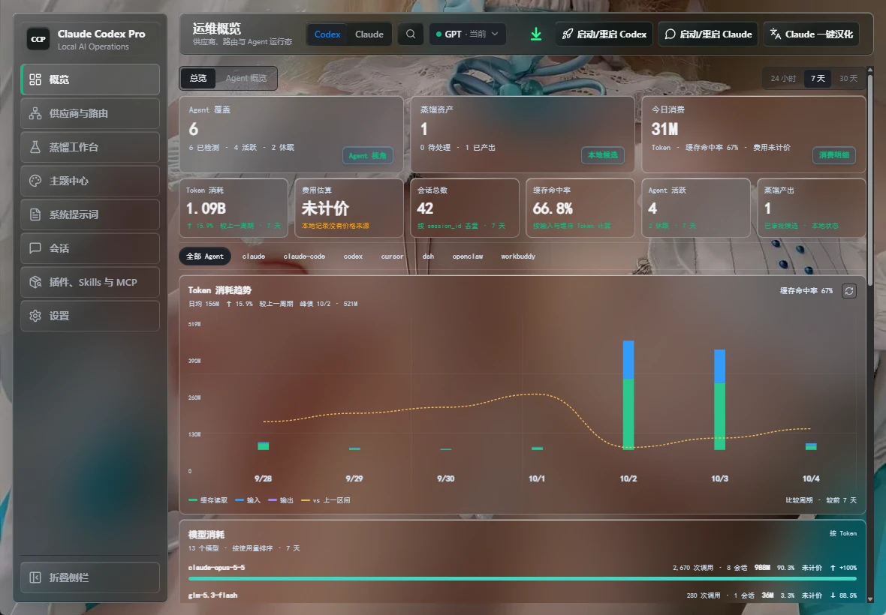
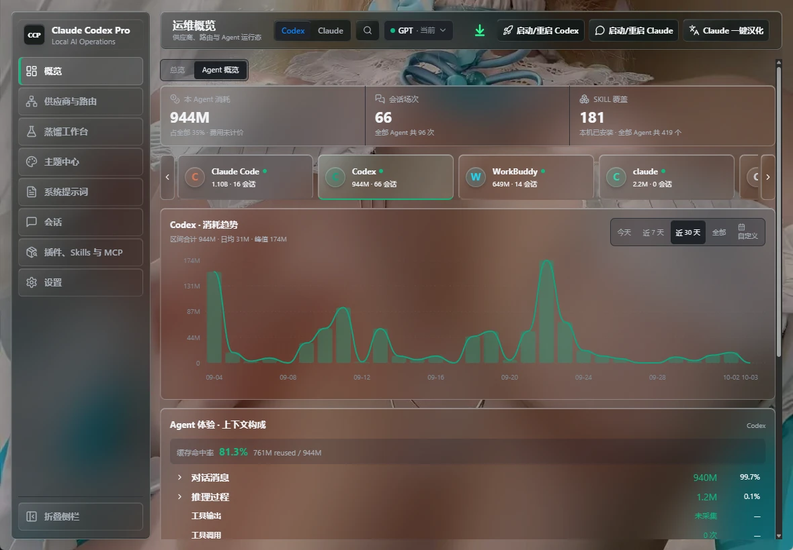
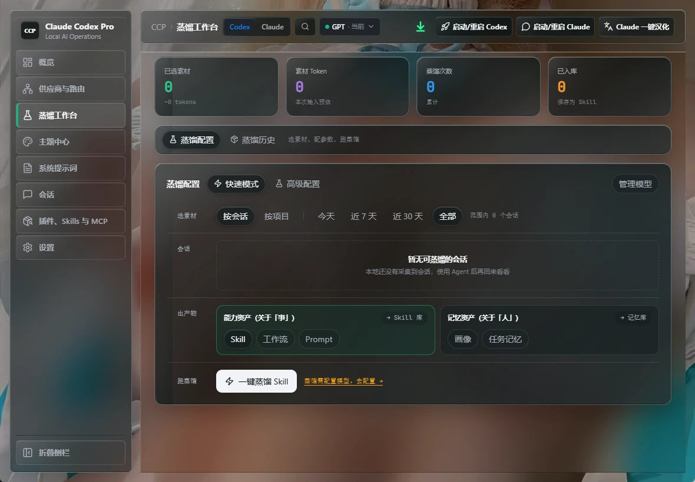
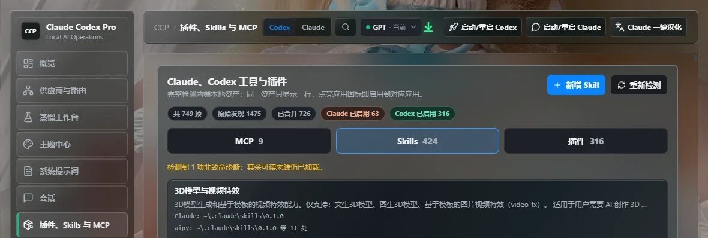

# Claude Codex Pro Tool

<p align="center">
  
</p>

<p align="center">
  <a href="README.md">中文</a> | English
</p>

<p align="center">
  
  
  
  
  
</p>

**One window for all your AI coding agents: see where each agent's tokens go, switch third-party APIs in one place, distill past sessions into reusable Skills and memory, and give Claude Desktop (including API mode) a built-in Computer Use.**

> A local AI operations console for Codex App, Claude Desktop, and Claude Code on Windows and macOS, with a built-in detection list of 36 popular agent tools. Built with Rust + Tauri; your data stays on your machine.
>
> Keywords: Codex, Claude Desktop, Claude Code, API relay, third-party API provider switcher, cc-switch alternative, model mapping, OpenAI Responses, Chat Completions, Anthropic Messages, MCP, Skills, Computer Use MCP, token usage dashboard, session repair, Tauri, Rust.

<table>
  <tr>
    <td width="50%" align="center"><a href="docs/screenshots/overview-total.webp"></a><br><sub><b>Overview</b> - token usage, cache hit rate, and model ranking across all agents</sub></td>
    <td width="50%" align="center"><a href="docs/screenshots/overview-agent.webp"></a><br><sub><b>Agent overview</b> - one agent's usage trend and context breakdown</sub></td>
  </tr>
  <tr>
    <td width="50%" align="center"><a href="docs/screenshots/distillation.webp"></a><br><sub><b>Distillation workbench</b> - sessions and projects into Skills, prompts, personas, task memory</sub></td>
    <td width="50%" align="center"><a href="docs/screenshots/tools-skills-mcp.webp"></a><br><sub><b>Plugins, Skills and MCP</b> - Claude and Codex assets in one list</sub></td>
  </tr>
</table>

**Contents:** [Why CCP](#why-ccp) · [Quick Start](#quick-start) · [Core Features](#core-features) · [Screenshots](#screenshots) · [Safety and Privacy](#safety-and-privacy) · [FAQ](#faq) · [Build and Development](#build-and-development)

## Why CCP

| The problem | How CCP handles it |
| --- | --- |
| You use several AI coding tools and have no idea where the tokens go | Read-only local collection; one dashboard for every agent's usage trend, cache hit rate, and model and project rankings |
| You change third-party APIs often and must edit every tool's config | Codex, Claude, and Claude Desktop each keep their own current provider; switch in one place without touching the others |
| Good solutions are buried in old sessions and you re-explain them every time | The distillation workbench turns a session or a whole project into a Skill, prompt, persona, or task memory |
| A long chat that outgrew its context is split across many session files | Continuations are detected and merged into one row; distillation reads the whole chain in order |
| Claude Desktop cannot operate the computer the way Codex can | A bundled Computer Use MCP: screenshot, click, drag, type, with an emergency stop; off by default |
| Skills, MCP servers, and plugins are scattered across tools | Claude and Codex assets in one inventory; clicking an app icon only changes that app |
| History "disappears" after switching providers | Provider Sync repairs session visibility |

**CCP is for you if you:**

- Use Codex, Claude Code, Claude Desktop,Workbuddy, Cursor, or other AI coding tools together and want to know where your tokens and money go.
- Switch between API relays or OpenAI/Anthropic-compatible providers.
- Want to turn repeated lessons and proven workflows into Skills instead of re-explaining them.
- Expect features to be observable and verifiable, not decorative buttons.

## Quick Start

1. Download and install from [GitHub Releases](https://github.com/DamonZS/Claude-Codex-Pro-Tool/releases):
   - Windows: `claude-codex-pro-*-windows-x64-setup.exe` or `claude-codex-pro-*-windows-x64.msi`
   - macOS Intel: `claude-codex-pro-*-macos-x64.dmg`
   - macOS Apple Silicon: `claude-codex-pro-*-macos-arm64.dmg`
2. Open **Claude Codex Pro Manager** and add a provider under Providers & Routing, or import existing ones from a local cc-switch database.
3. Launch clients with the manager's "Start/Restart Codex" and "Start/Restart Claude" buttons (launching the original Codex directly gives you no enhancements).
4. Open Overview to see each agent's token usage; then enable Computer Use, distill sessions, or install Skills as needed.

Installation provides two entries:

- `Claude Codex Pro`: the unified desktop program. It opens the manager by default and starts the independent background process with `--launcher` to load Codex enhancements.
- `Claude Codex Pro 管理工具` (Manager): the operations console for Codex, Claude, providers, plugins, scripts, logs, installation maintenance, and updates.

The Windows installer creates Desktop and Start Menu shortcuts. The macOS DMG contains `Claude Codex Pro.app` and `Claude Codex Pro 管理工具.app`.

> **Codex owns the model picker.** CCP does not inject model candidates, change the Codex model whitelist, or override model fields in requests. The Providers page can still manage provider catalogs and routing configuration, but Codex decides which models are visible and selectable based on its own version, login state, configuration, and upstream API capabilities.

Canonical repository: <https://github.com/DamonZS/Claude-Codex-Pro-Tool>

## Core Features

### Multi-Agent Usage Dashboard

Read-only local collection with a built-in detection list of 36 popular agent tools (Claude Code, Codex, Cursor, Kiro, Gemini CLI, OpenCode, OpenClaw, Hermes, GitHub Copilot, Zed, Cline, Roo Code, Goose, WorkBuddy, and more); 35 of them declare usage paths. Only agents that have records on your machine show data, and nothing is invented for the rest.

- **Overview:** agent coverage, distilled assets, and today's usage; token usage, cost estimate, total sessions, cache hit rate, and active agents; a token trend chart (cache read / input / output, compared with the previous period), a per-model usage ranking, a project usage overview, and a 12-month activity calendar. Ranges: 24 h / 7 d / 30 d.
- **Agent overview:** pick one agent to see its own usage trend, context breakdown (conversation, reasoning, cache), usage by model or by project, session count, and Skill coverage. Ranges: Today / 7 d / 30 d / All / custom.
- **Honest numbers:** cost shows "unpriced" when there is no price source; metrics that cannot be collected show "not collected"; session IDs are anonymized and content is not read.

### Providers and Routing

- **Three independent targets:** Codex, Claude, and Claude Desktop each keep their own current provider. Switching one never changes the others, and the success message names the target.
- **Three protocols:** OpenAI Responses, Chat Completions, and Anthropic Messages, with model mapping and protocol conversion for compatible channels.
- **Profiles:** Base URL, API key, headers, body, User-Agent, model catalog, context window, auto-compaction threshold, priority, and failover; connectivity test and drag-to-reorder.
- **Codex modes:** official, official + API hybrid, and API-only; backfill from the current `~/.codex/config.toml` and `auth.json`, or clear API mode to return to the official login.
- **Claude Desktop direct-connect:** third-party Anthropic-compatible providers can use the model IDs returned by their `/v1/models` without forcing model mapping; model mapping and manual model lists remain available. With mapping off, the provider's real URL is used instead of the local proxy.
- **One-click import:** import existing Codex / Claude / Claude Desktop providers from a local cc-switch database, keeping their routing and API format.

Example: a custom Codex provider is written to `~/.codex/config.toml`:

```toml
model_provider = "custom"

[model_providers.custom]
name = "custom"
wire_api = "responses"
requires_openai_auth = true
base_url = "https://example.com/v1"
experimental_bearer_token = "sk-..."
```

### Distillation Workbench: Turn Sessions into Assets

Extracts reusable assets from local Codex and Claude sessions. Interaction and processing logic follow AITracker's distillation module (Copyright (C) 2026 AITracker contributors, used with the copyright holder's permission), with CCP's liquid-glass styling.

- **Pick material:** quick mode selects by session or by project with Today / 7 d / 30 d / All filters; advanced mode lets you select message ranges across sessions in the material library.
- **Reads the real conversation:** selecting a whole session or project sends the model the conversation body (reasoning blocks excluded), not just a title and turn count.
- **Outputs:** capability assets (Skill, workflow, prompt; saved to the Skill library and installable to chosen agents) and memory assets (persona, task memory; written to the memory library).
- **Long chats are not truncated:** the input budget scales with the selected provider's `contextWindow` (one call uses at most 60% of it). Anything larger is distilled in ordered batches, each extracting key points, then merged into the final output; at most 12 batches, cancellable at any time.
- **Continuation merge:** when a Claude conversation outgrows its context it continues in a new session file. CCP merges sessions with the same project and title, a continuation prompt as the first message, and adjacent timing into one row, sums their tokens, and shows "N segments".
- **Project meaning:** for both Claude and Codex the "project" is the project folder (git root) name; git worktrees roll up into their main repository.
- **Quality and traceability:** Skill, workflow, and prompt outputs are quality-checked with up to 2 retries. Failures show a Chinese reason with a stable code such as `ai.provider-network`, `ai.provider-unavailable`, or `ai.provider-auth`.
- **Your model, your data:** it uses the models you configured under Providers. The selected session content is sent to that provider, so make sure you trust it. An "offline fallback" reads no content and makes no network calls.

### Claude Desktop Computer Use (MCP)

Gives Claude Desktop a Codex-style "see the screen, drive the mouse and keyboard" capability. CCP bundles a local stdio MCP server (`claude-codex-pro.exe --mcp-computer-use`, no extra executable) and registers it in Claude Desktop as `claude-codex-pro-computer-use`.

- **10 tools:** `screenshot`, `click`, `move_mouse`, `drag`, `drag_path`, `scroll`, `type_text`, `press_keys`, `cursor_position`, `wait`.
- **One-stroke drag:** `drag_path` holds the left button through 2-200 points and releases once, suitable for curves, circles, and signatures. `drag` and `drag_path` always release the button even if a step fails.
- **Screenshots:** primary display only, downscaled to at most 1280x800 JPEG. All coordinates are screenshot pixels, mapped to real screen coordinates internally; out-of-range points are rejected.
- **Safety:** off by default and re-read on every call. Throwing the mouse into the top-left corner of the primary display triggers an **emergency stop**: the next action is refused and the switch is turned off. Diagnostics log tool names and coordinates; `type_text` logs only the character count.
- **Config writes:** enabling writes the entry into every normal Claude Desktop config and any existing `Claude-3p` (API / developer mode) config, with a backup first. Unparseable configs are never overwritten. Fully quit and restart Claude Desktop after toggling.
- **Where:** the dedicated **Computer Use** tab in the manager's Settings page, with the switch, registration status, and recent calls.
- **Platforms:** Windows (SendInput + GDI capture) and macOS (CoreGraphics). The macOS path has only been compile-checked, not verified on real hardware.
- **Heads-up:** it moves the real mouse, and screenshots may contain sensitive on-screen information. Tidy your windows first.

Experimental: the `uia` module provides Windows UI Automation element lookup, pattern actions, and keyboard input. It is for internal testing only and **not yet wired into the MCP tools above**.

### Plugins, Skills, and MCP Inventory

- **One row per asset:** Claude and Codex MCP servers, Skills, and plugins are merged into one list. A row shows which app has it enabled, and clicking an app icon changes only that app.
- **Full discovery:** detects everything parseable on the machine, not just what CCP manages, with "enabled" counts and source paths.
- **Add MCP / Skill:** a new MCP server is written to both the Claude config and `~/.codex/config.toml`; Skill descriptions are parsed from YAML frontmatter.

### Plugin Hub and Ponytail

The Plugin Hub merges many sources into one catalog: the official Claude plugin marketplace, Claude Desktop MCP entries, the GitHub MCP Registry, Awesome Claude Code, the OpenAI Codex Plugins repository, Ponytail, and recognizable Skill bundles. Each entry shows source, category, author, license, install state, risk notes, dependencies, an install-command preview, and a config diff.

- Official Claude plugins use `claude plugin marketplace add/install`; Codex plugins use `codex plugin marketplace add/list/add`.
- Claude Desktop MCP entries are written to `claude_desktop_config.json` after a backup.
- Unknown community MCP entries are only displayed, never executed; Skill bundles install only when their structure is recognized.
- [DietrichGebert/ponytail](https://github.com/DietrichGebert/ponytail) is integrated (`ponytail@ponytail` in Codex) for Codex, Claude Code, GitHub Copilot CLI, and Claude Desktop (MCP, organization plugin, and an `.mcpb` package handed to Claude Desktop's official confirmation flow). Ponytail's Codex hooks are previewed and trusted only after your explicit confirmation.
- The official `openai/plugins` repository can be downloaded with a size limit and safe extraction (zip path-traversal protection); `.agents/plugins/marketplace.json` and each plugin directory's `.codex-plugin/plugin.json` are validated before registering `[marketplaces.openai-curated]`.

### Session Management

- **Grouped by project:** a Codex-style project / session list; click a session for its full context (paged, long messages expand naturally).
- **Isolated data sources:** Codex reads local SQLite / rollout data, Claude reads `~/.claude/projects` and related sources, and the two never mix.
- **Repair and migration:** Provider Sync restores session visibility after a provider switch; delete sessions, export Markdown, move project ownership; both the new `~/.codex/sqlite/*.db` and the legacy `state_5.sqlite` are detected.

### Codex Launch and Enhancements

Launches Codex through an external launcher, handles CDP / helper connections automatically, and injects a status badge into the Codex page. It does not modify official Codex installation files.

- Plugin-entry and plugin-marketplace-entry unlock; adapts to the new plugin install channel (`vscode://codex/list-plugins`, `vscode://codex/plugin/install`).
- Service-tier control entry, image override configuration, and Codex Goals configuration.
- Session scroll restoration, session timeline and view enhancements, and native menu positioning.
- Computer Use Guard to reduce accidental high-risk automation.

### Claude Desktop Management and Chinese Localization

- Launch / focus the official Claude Desktop, open DevTools, start a new conversation, and paste a draft or submit text into it.
- Detect install location, process state, and integrity; official MSIX / CDP blocks are reported honestly rather than pretending to be injected.
- **Two Chinese paths:**
  - **Chinese wrapper window:** a separate WebView loads `https://claude.ai/new` and injects a Chinese overlay at creation time. It does not touch official install files and is the recommended option.
  - **One-click localization (resource patch):** an optional local patch based on the public resources of `Jyy1529/claude-desktop_win-zh_cn` that writes `zh-CN.json`, locale configuration, and the needed frontend language support. It backs up first, provides a restore entry, and only runs when you trigger it.

### Themes and Appearance

- A dedicated top-level entry with three-column theme cards; the Codex default theme is always first. "CCP Appearance" and "Codex Themes" are separate views.
- No-code DIY workbench: adjust glass transparency, blur, corner radius, font size, and a local background with live preview, saving, and re-editing.
- Download, import, preview, apply, delete, and restore themes from the official GitHub theme library; curated packs and the authoring guide are in [`Theme/`](Theme/).
- Themes are validated in a temporary directory, then atomically replace the live version while keeping the previous one; visual injection is isolated from localization and model-badge injection.
- The CCP background gallery saves, switches, and deletes multiple local high-resolution backgrounds; restoring defaults does not clear it.

### System Prompts and Instruction Templates

- A dedicated top-level entry with compact cards for general, jailbreak, and reverse-analysis instruction templates; five built-in Markdown templates live in [`assets/system-prompts/`](assets/system-prompts/).
- Add, edit, delete, and import Markdown, or sync from a URL / GitHub address.
- "Keep original prompt" and "replace original prompt" activation modes, with the active state clearly shown.
- `~/.codex/config.toml` is backed up before every write, and external edits are detected so other tools' or your manual changes are not silently overwritten.
- A built-in "How to use" guide; the source is [`ccp-deepseek-guide.md`](apps/claude-codex-pro-manager/src/content/ccp-deepseek-guide.md).

### Scripts, Zed Remote, Worktrees, and Self-Recovery

- **Script market:** refresh, download and install, enable / disable, and delete user scripts; build the enabled-scripts bundle and inject it through Codex.
- **Zed Remote:** detect Zed and SSH host / user / port, resolve remote projects from Codex global state and thread context, build `zed://ssh/...` links, and choose default / reuse window / new window / append to current window.
- **Upstream Worktree:** read remotes, branches, and worktrees; create a worktree from the latest remote-tracking branch; validate branch and base names; avoid branching tasks from a stale local HEAD.
- **Watcher and self-recovery (Windows):** detect the Codex process and CDP port, restore a dead launcher, and install, uninstall, enable, or disable the watcher.

### Installation Maintenance and Automated Releases

- Install / uninstall entries, shortcut and backend repair, update checks, Release asset download and installer launch, latest log, diagnostics copy, and settings reset.
- **Auto release:** `Auto release installers` runs on a `main` push or manually, computes the next `V0.01`-series version, creates the tag, builds the Windows installer and macOS x64 / arm64 DMGs, and uploads `latest.json`. Release notes list the commits included. Versions advance `V0.01 -> V0.02 -> ... -> V0.99 -> V1.00`.

## Screenshots

The four images above show the Overview, the Agent overview, the Distillation Workbench, and Plugins/Skills/MCP. The full set of pages is: Overview (total / per-agent), Providers & Routing, Distillation Workbench, Theme Center, System Prompts, Sessions, Plugins/Skills/MCP, and Settings (including Computer Use).

## Safety and Privacy

**Principles**

- **Local first:** configuration, plugin records, logs, and backups stay on your machine whenever possible; usage collection is read-only and session IDs are anonymized.
- **Reviewable:** commands or diffs are shown before installing plugins, writing MCP configuration, trusting hooks, or changing important settings.
- **Recoverable:** critical configuration is backed up when practical, and the Chinese resource patch has a restore path.
- **No silent trust:** Ponytail and Codex hooks require separate review and explicit trust.
- **No simulated capability:** actions that cannot be automated or need your confirmation are labeled clearly.

**Boundaries**

- Computer Use is off by default; it moves the real mouse and keyboard, and throwing the mouse into the top-left corner of the primary display stops it.
- CCP does not silently modify Claude Desktop's private plugin library, run unknown community MCP install scripts, or treat third-party GitHub content as trusted code.
- API keys, bearer tokens, and full auth configuration are never written to ordinary logs.
- The Chinese wrapper window does not modify official Claude Desktop files; the one-click localization is a local patch you trigger explicitly, backed up first and restorable.
- CCP manages local configuration and third-party APIs only and does not take over official accounts, subscriptions, or payments.

**Where your data goes:** the usage dashboard makes no network requests. Requests are sent only when you use distillation, connectivity tests, or download themes, plugins, or updates, and only to the provider or source involved. Distillation sends the selected session content to the model provider you chose.

## Data Locations

| Content | Location |
| --- | --- |
| Codex config / login state | `~/.codex/config.toml`, `~/.codex/auth.json` |
| Codex database | `~/.codex/sqlite/*.db` first, falling back to the legacy `~/.codex/state_5.sqlite` |
| Codex plugin repository cache / skills | `~/.codex/.tmp/plugins`, `~/.codex/skills` |
| Claude Desktop MCP config | On Windows usually `%APPDATA%\Claude\claude_desktop_config.json` |
| Claude Desktop 3P (API) config | On Windows usually `%LOCALAPPDATA%\Claude-3p`; MSIX installs use `%LOCALAPPDATA%\Packages\Claude_*\LocalCache\Roaming\Claude-3p` |
| CCP state | `~/.claude-codex-pro/` |
| Distillation tasks and candidates | `~/.claude-codex-pro/aitracker/` |
| Provider Sync backups | `~/.codex/backups_state/provider-sync` |

## FAQ

### The Codex enhancement badge does not appear
Make sure you launched Codex from the `Claude Codex Pro` entry rather than the original Codex. If it still does not appear, open the manager's diagnostics and logs and check the helper port, the CDP connection, and `renderer.script_loaded` records.

### Who controls the Codex model picker?
The native Codex client owns the model menu, visible models, and current selection. CCP does not inject model candidates, add a "CCP model enhancement" group, or override `model`, `model_slug`, or `modelId` in Codex requests. If a model is missing, check Codex's own login state, version, and configuration, and the provider's upstream model catalog; CCP's provider model list is only for configuration and routing.

### Claude is not shown in Chinese
Prefer `Open Claude Chinese Window`. It is a separate WebView wrapper, not the official Claude Desktop window. If you use the resource patch, make sure Claude Desktop is fully closed and the install directory is writable, and check the patch status or restore if it fails.

### Distillation failed. What now?
History shows the reason with a stable code. `ai.provider-network` means it could not connect (check the Base URL and network), `ai.provider-unavailable` means an upstream 5xx (retry later or change model), `ai.provider-auth` means authentication failed (check the API key), and `ai.provider-invalid-response` means the model returned only reasoning or empty content (change model). Very long material is processed in batches and the task detail shows "x / n batches processed".

### Computer Use is on but Claude Desktop shows no tools
The switch only writes the MCP entry into Claude Desktop's config. After it is written, **fully quit** and restart Claude Desktop (including the tray). The API (3P) config is written only when a `Claude-3p` config file already exists. If tools still do not appear, check which config paths the registration status in the Settings "Computer Use" tab lists.

### Plugin installation failed
Open the install preview and confirm the type: official Claude plugins need the `claude` CLI; Claude Desktop MCP needs to write `claude_desktop_config.json`; Claude Desktop local organization plugins need developer mode and directory write access; Codex plugins need the `codex` CLI; Ponytail hooks need separate review and trust; community MCP and Skills need a recognizable structure.

### Why does a Release contain only source-code archives?
If the installer build job succeeds but the publish job fails, GitHub shows only the auto-generated source archives. Check the `Publish release and latest.json` step of `Auto release installers`.

### macOS says the app cannot be opened or is damaged
Unsigned or unnotarized builds can be blocked by Gatekeeper. Allow the app in System Settings → Privacy & Security; if it still says damaged:

```bash
sudo xattr -rd com.apple.quarantine /Applications/Claude\ Codex\ Pro.app
sudo xattr -rd com.apple.quarantine /Applications/Claude\ Codex\ Pro\ 管理工具.app
```

### Does it support Intel Macs?
Yes. Releases provide `macos-x64.dmg` and `macos-arm64.dmg`; use x64 on Intel Macs and arm64 on Apple Silicon.

## Build and Development

This project is a Rust workspace plus a Tauri manager and a Vite/React frontend. The root `package.json` comes from the upstream structure and is not used to build this project; frontend dependencies are installed and built under `apps/claude-codex-pro-manager`.

### Requirements

- Git, Node.js 22 or newer, and npm.
- Rust stable toolchain with `cargo`, `rustc`, and `rustfmt`.
- Windows: Visual Studio Build Tools / MSVC C++ toolchain; NSIS to build the installer (`choco install nsis -y`); WiX Toolset for MSI (the Release workflow installs it automatically).
- macOS: Xcode Command Line Tools; DMG packaging uses the system `sips`, `iconutil`, `codesign`, and `hdiutil`; run `rustup target add x86_64-apple-darwin aarch64-apple-darwin`.

### Install Dependencies

```bash
npm --prefix apps/codex-workflow-surface install --package-lock=false
npm --prefix apps/claude-codex-pro-manager install --package-lock=false
```

Each package installs its own dependencies; use `npm ci` when a matching lockfile exists. CI currently uses `npm install --package-lock=false`.

The manager's `vite:build` and `dev` scripts first run the in-repo workflow package's `check`, `test`, and `build`, then start the Vite build or Tauri; `build` goes through `vite:build` via Tauri's `beforeBuildCommand`. Browser-only `vite:dev` stays independent. Normal builds never install dependencies over the network. The workflow uses vendored in-repo source and does not depend on an external Multica checkout. **Before running Cargo build or test directly, run the manager's `vite:build`** to generate `apps/codex-workflow-surface/dist/codex-workflow-surface.js` and `.css`, which core embeds with `include_str!`.

### Start Local Development

```bash
cd apps/claude-codex-pro-manager
npm run dev        # Tauri CLI starts the manager and runs Vite (http://localhost:1420)
npm run vite:dev   # frontend only
```

A plain browser preview has no Tauri backend, so buttons touching system configuration, processes, plugin installation, or Claude localization return preview output or cannot run. Use `npm run dev` to verify real behavior.

### Local Verification

Before committing:

```bash
node scripts/release/verify-release-workflow.js
node --test scripts/release/stage-multica-notices.test.mjs
npm --prefix apps/claude-codex-pro-manager run check
npm --prefix apps/claude-codex-pro-manager run vite:build
cargo fmt --check
cargo test --workspace
cargo build --release
```

Useful targeted checks:

```bash
cargo test -p claude-codex-pro-core --manifest-path Cargo.toml plugin_hub -- --nocapture
cargo test -p claude-codex-pro-core --manifest-path Cargo.toml relay_config -- --nocapture
cargo test -p claude-codex-pro-manager --manifest-path Cargo.toml --test windows_subsystem -- --nocapture
cargo test -p claude-codex-pro-manager --lib distill_pipeline     # distillation pipeline and batching
cargo test -p claude-codex-pro-core --lib claude_session_chain    # continuation-chain detection
```

### Production Binaries

```bash
npm --prefix apps/claude-codex-pro-manager run vite:build
cargo build --release
```

The main artifact is `target/release/claude-codex-pro.exe` (no `.exe` suffix on macOS and Linux). You can also run `npm run build` in the manager directory to build the unified desktop program; official installers still come from the NSIS and DMG scripts.

### Windows Installer

```powershell
npm --prefix apps/codex-workflow-surface install --package-lock=false
npm --prefix apps/claude-codex-pro-manager install --package-lock=false
npm --prefix apps/claude-codex-pro-manager run check
npm --prefix apps/claude-codex-pro-manager run vite:build
cargo test --workspace
cargo build --release

New-Item -ItemType Directory -Force dist/windows/app | Out-Null
Copy-Item target/release/claude-codex-pro.exe dist/windows/app/
node scripts/release/stage-multica-notices.mjs dist/windows/app/resources/third-party/multica

$version = "0.12"
$makensis = "${env:ProgramFiles(x86)}\NSIS\makensis.exe"
if (-not (Test-Path $makensis)) { $makensis = "makensis" }
Push-Location scripts/installer/windows
& $makensis "/INPUTCHARSET" "UTF8" "/DVERSION=$version" ClaudeCodexPro.nsi
Pop-Location
```

Output: `dist/windows/claude-codex-pro-0.12-windows-x64-setup.exe`. The ZIP / NSIS staging directory contains `resources/third-party/multica/LICENSE` and `NOTICE`, byte-for-byte identical to `docs/third-party/multica/`. The MSI uses `scripts/installer/windows/tauri-msi.conf.json` to map the same license files and keep Leila resources; run this in the manager directory:

```bash
npm exec tauri build -- --bundles msi --config ../../scripts/installer/windows/tauri-msi.conf.json
```

Shipping the license files does not replace upstream commercial licensing requirements.

### macOS DMG

```bash
# Apple Silicon
npm --prefix apps/codex-workflow-surface install --package-lock=false
npm --prefix apps/claude-codex-pro-manager install --package-lock=false
npm --prefix apps/claude-codex-pro-manager run vite:build
rustup target add aarch64-apple-darwin
cargo build --release --target aarch64-apple-darwin
BINARY_DIR="$PWD/target/aarch64-apple-darwin/release" bash scripts/installer/macos/package-dmg.sh 0.12 arm64

# Intel Mac: replace aarch64-apple-darwin with x86_64-apple-darwin and the last argument with x64
```

Output: `dist/macos/claude-codex-pro-0.12-macos-arm64.dmg` (`-macos-x64.dmg` for Intel). The local script uses ad-hoc codesign and does not do Apple Developer ID signing or notarization, so a local DMG may trigger Gatekeeper; allow it manually as described in the FAQ. Before signing, the DMG script places the complete Multica `LICENSE` / `NOTICE` under `.app/Contents/Resources/third-party/multica/` and verifies they match the originals after signing.

### GitHub Actions

- `.github/workflows/auto-release-installers.yml`: automatic releases on a `main` push or manual trigger.
- `.github/workflows/pr-build.yml`: build verification for PRs, `main` pushes, and manual runs.
- `.github/workflows/release-assets.yml`: reserved for manual GitHub Releases.

Automatic release: push to `main` -> `scripts/release/next-release-tag.js` reads existing tags and computes the next one -> create the tag and a draft Release -> Windows, macOS Intel, and macOS Apple Silicon runners build -> upload installers -> publish the Release -> generate and upload `latest.json`.

## Project Structure

```text
apps/
  claude-codex-pro-launcher/          internal launcher library
  claude-codex-pro-manager/           unified Tauri app and manager (React/Vite frontend + Rust backend)
  codex-workflow-surface/             source of the Codex embedded workflow pages
assets/inject/
  renderer-inject.js                  Codex enhancement script
  claude-chinese-inject.js            Claude Chinese wrapper window script
crates/
  claude-codex-pro-core/              launch, injection, config, providers, plugins, Computer Use, updates, install, bridge
  claude-codex-pro-data/              session data, usage collection, export, Provider Sync
scripts/installer/
  windows/ClaudeCodexPro.nsi          Windows NSIS installer
  macos/package-dmg.sh                macOS DMG packaging script
spec/ acceptance/                     task specs and acceptance criteria
docs/                                 architecture, reviews, and screenshots
```

## Feedback

- Issues: <https://github.com/DamonZS/Claude-Codex-Pro-Tool/issues>
- Discussion-group QR code: <https://kcnl7iasnc4t.feishu.cn/wiki/O4T8wAodLiz05MkpqVkcoI7SnRd?from=from_copylink>

## License and Repository Rules

This repository uses a custom source-available restrictive license and is not licensed under an OSI-approved open-source license. Without written permission from DamonZS or an authorized maintainer, modifying, publishing, distributing, renaming, repackaging, or hiding the origin of this project is prohibited. This restriction covers manual edits, AI-assisted edits, scripts, codemods, bulk replacement, automated rewrites, binary patches, and metadata changes.

Author information, repository URLs, copyright notices, product names, branding, publisher identity, sponsorship or payment identity, license files, and rule files must not be removed, replaced, hidden, or weakened.

These restrictions do not apply to DamonZS, the repository owner, authorized maintainers, or AI assistants, scripts, CI, codemods, formatters, and automation working under their direction. Official project development may continue to use AI and automation.

See [MAINTAINERS.md](MAINTAINERS.md) for the authorized maintainer list. See [LICENSE](LICENSE) and [RULES.md](RULES.md) for the complete terms.

## Disclaimer

Claude Codex Pro Tool is an external enhancement tool. It is not an official project of OpenAI, Anthropic, Claude, or Codex. When official applications change page structure, protocols, CLI behavior, plugin formats, or configuration paths, this project's injection scripts and adapters may need corresponding updates.

