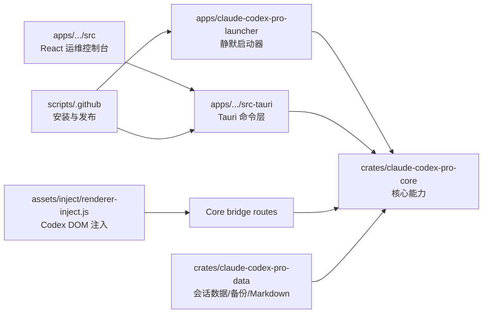
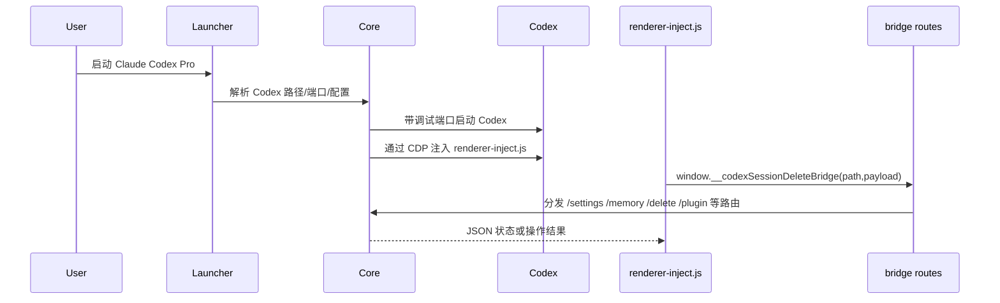
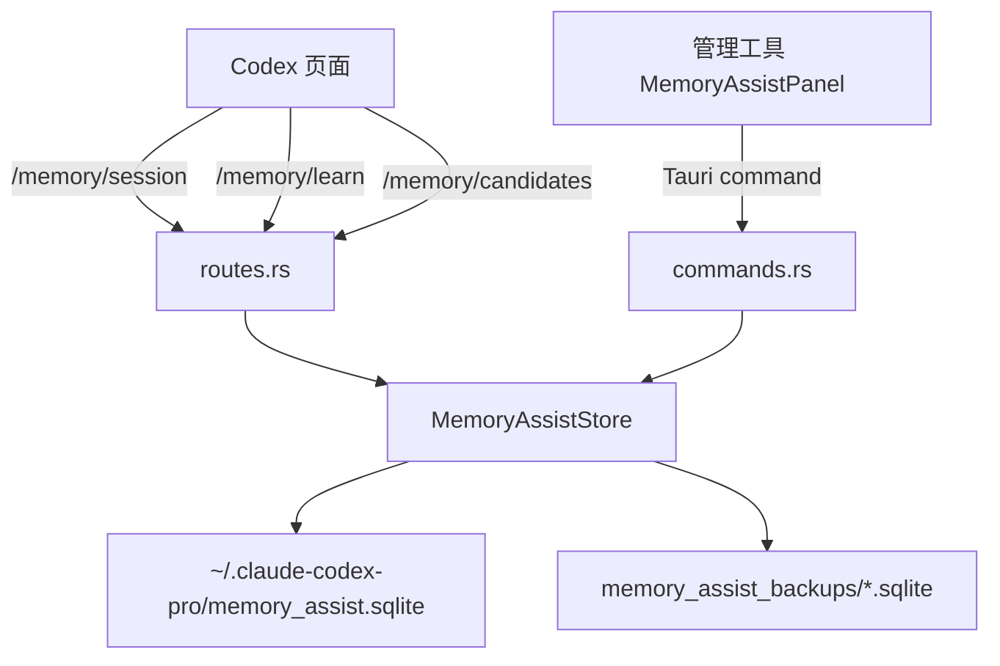
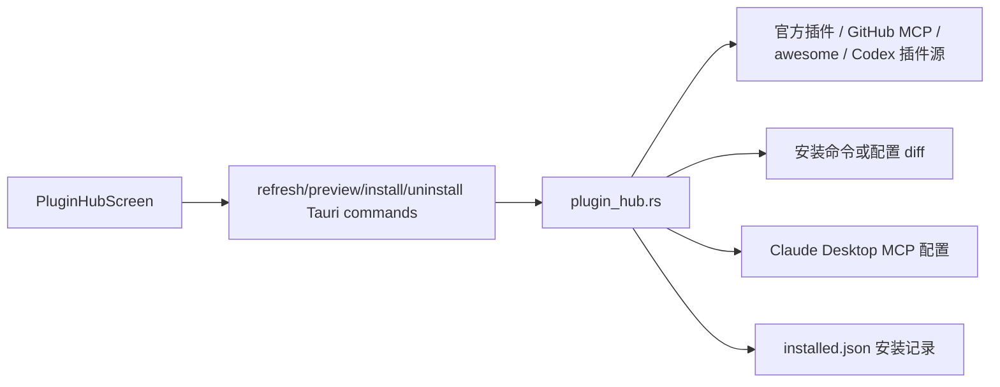
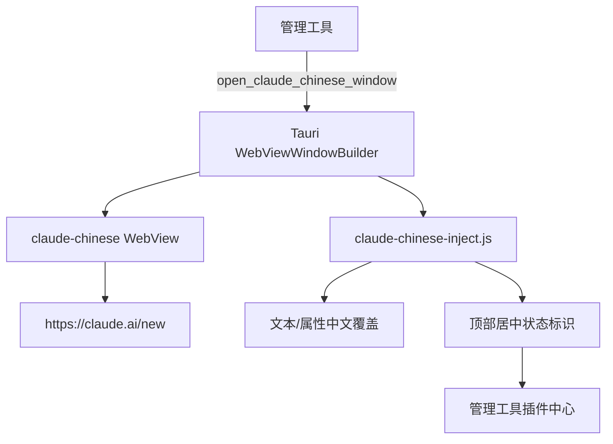

# Claude Codex Pro Tool 代码知识图谱

生成时间：2026-06-22  
分支：`codex/memory-assist`  
范围：当前工作区源码、未提交改动、核心测试与构建入口。  

> 说明：本仓库当前没有 `.understand-anything/knowledge-graph.json`，CodeGraph 索引也未初始化。本文件是基于源码静态阅读、`rg` 扫描和测试运行结果整理的项目级知识图谱，用于项目文档与后续维护。

## 项目概览

Claude Codex Pro Tool 是一个 Rust/Tauri + React 的本地运维控制台，用来管理 Codex App、Claude Desktop 包装窗口、供应商配置、插件中心、会话维护、脚本市场、提示词优化与本地记忆辅助。

## 架构层

| 层 | 主要文件 | 职责 |
| --- | --- | --- |
| 启动与注入 | `apps/claude-codex-pro-launcher/src/main.rs`, `crates/claude-codex-pro-core/src/launcher.rs`, `assets/inject/renderer-inject.js` | 启动 Codex、连接 CDP/helper、本地桥接、DOM 增强、状态标识和会话工具。 |
| 核心域逻辑 | `crates/claude-codex-pro-core/src/*.rs` | 设置、供应商配置、Claude Desktop 诊断、插件中心、记忆辅助、模型目录、更新、Watcher、Zed Remote、worktree。 |
| 数据维护 | `crates/claude-codex-pro-data/src/*.rs` | Codex SQLite 会话读取、删除/恢复、Markdown 导出、provider sync。 |
| 管理工具后端 | `apps/claude-codex-pro-manager/src-tauri/src/commands.rs`, `lib.rs` | Tauri command 聚合、窗口管理、设置/插件/记忆/日志/安装命令暴露给前端。 |
| 管理工具前端 | `apps/claude-codex-pro-manager/src/App.tsx`, `styles.css`, `tauriBridge.ts` | 运维控制台 UI、路由、状态刷新、插件中心、记忆辅助、设置页。 |
| 包装窗口与页面脚本 | `assets/inject/claude-chinese-inject.js`, `assets/inject/renderer-inject.js` | Claude 中文包装窗口文本覆盖、Codex 页面增强、前端桥接 UI。 |
| 构建发布 | `.github/workflows/*.yml`, `scripts/installer/*`, `Cargo.toml`, `package.json` | CI、DMG/NSIS 打包、版本与构建命令。 |

## 核心节点

| 节点 | 类型 | 摘要 |
| --- | --- | --- |
| `MemoryAssistStore` | Rust struct | 本地 SQLite 记忆库入口，负责学习、查询、候选确认、自检、导入导出和备份。 |
| `handle_bridge_request` | Rust function | Codex DOM 注入脚本调用的本地 bridge 路由分发器。 |
| `CoreRuntimeService` | Rust struct | bridge runtime 实现，接入用户脚本、Claude Desktop 诊断、Zed Remote、worktree、memory assist。 |
| `commands.rs` Tauri commands | Rust module | 管理工具所有命令出口，包括 Claude 窗口、插件中心、记忆辅助、供应商、会话与日志。 |
| `App.tsx` | React module | 单页运维控制台，管理 route、状态刷新、插件中心、记忆辅助 UI 和设置页。 |
| `renderer-inject.js` | Browser script | Codex 页面内增强入口，负责 DOM 扫描、状态标识、会话工具、插件按钮、记忆辅助面板。 |
| `plugin_hub.rs` | Rust module | 插件目录模型、来源适配、安装预览和安装记录。 |
| `relay_config.rs` | Rust module | Codex provider/config/auth 写入、清除、测试和同步。 |
| `claude_zh_patch.rs` | Rust module | Claude 本机汉化/恢复能力，属于更高风险路径，和安全包装窗口分离。 |
| `claude-chinese-inject.js` | Browser script | 独立 Claude WebView 中文覆盖、MutationObserver、顶部状态标识和插件中心入口。 |

## 关键数据流

### Codex 启动与增强

### 记忆辅助

行为要点：

- 正式记忆写入 `memory_items`，待确认学习写入 `memory_candidates`。
- 查询默认使用当前 workspace + `global`，管理工具可用 `__all__` 查看全局。
- 写入前会对 `sk-` 和 `Bearer ` token 做脱敏。
- Codex DOM 注入只自动创建候选项，确认后才进入长期记忆。

### 插件中心

安全边界：

- 第三方 GitHub 内容默认展示元数据，不静默执行脚本。
- 安装前通过 preview 展示命令或配置 diff。
- Claude Desktop MCP 写入用户配置，而不是修改官方安装包。

### Claude 中文路径

约束：

- 不对官方 Claude Desktop MSIX/app.asar 做 DOM 强注入。
- 官方 Claude Desktop 按钮只负责启动或诊断。
- 中文包装窗口是单独 WebView。

## 主要边

| Source | Edge | Target | 说明 |
| --- | --- | --- | --- |
| `renderer-inject.js` | calls | `/memory/session` | 会话打开或扫描时读取记忆摘要。 |
| `renderer-inject.js` | calls | `/memory/candidates` | 识别“记住/以后/项目约定”等表达后创建待确认记忆。 |
| `routes.rs` | depends_on | `MemoryAssistStore` | bridge memory 路由全部落到核心 store。 |
| `commands.rs` | depends_on | `MemoryAssistStore` | 管理工具记忆 UI 通过 Tauri command 操作同一 SQLite。 |
| `App.tsx` | invokes | `commands.rs` | `call<T>()` 封装所有 Tauri invoke。 |
| `commands.rs` | configures | `plugin_hub.rs` | 刷新插件目录、预览安装、安装/卸载记录。 |
| `commands.rs` | configures | `relay_config.rs` | 供应商配置写入 Codex home。 |
| `launcher.rs` | serves | bridge HTTP/helper | 为注入脚本提供本地桥接能力。 |
| `claude-chinese-inject.js` | triggers | `open_plugin_hub_window` | Claude 包装窗口内入口跳回管理工具插件中心。 |
| `claude-codex-pro-data` | reads_from/writes_to | Codex SQLite | 会话管理、删除、恢复、Markdown 导出和 provider sync。 |

## 测试覆盖图

| 测试文件 | 覆盖 |
| --- | --- |
| `crates/claude-codex-pro-core/tests/memory_assist.rs` | 记忆学习、查询、workspace、脱敏、去重、候选确认、导入导出、自检。 |
| `crates/claude-codex-pro-core/tests/bridge_routes.rs` | bridge 路由、memory bridge、诊断日志、会话操作。 |
| `crates/claude-codex-pro-core/tests/cdp_bridge.rs` | 注入脚本加载、CDP 交互、诊断。 |
| `crates/claude-codex-pro-core/tests/launcher.rs` | helper HTTP、诊断日志、启动器行为。 |
| `crates/claude-codex-pro-data/tests/*.rs` | Codex SQLite 会话数据、Markdown、provider sync。 |
| `apps/claude-codex-pro-manager/src-tauri` tests | Tauri 命令、Windows subsystem、安装维护边界。 |

## 风险热点

1. `assets/inject/renderer-inject.js` 大量使用 DOM 扫描和动态 `innerHTML`，必须保持所有动态字段经过 `escapeHtml`。
2. `crates/claude-codex-pro-core/src/memory_assist.rs` 负责本地长期数据，脱敏、导入导出和备份是安全重点。
3. `routes.rs` 的 `/diagnostics/log` 会记录 renderer payload，新增日志字段时必须避免写入 token、API key 或 Bearer。
4. `commands.rs` 集中 Tauri 权限面，文件写入和外部命令调用必须保持 allowlist。
5. 插件中心安装路径涉及 Claude CLI 和 MCP 配置写入，必须继续保持 preview-first 和备份。
6. Claude 本机汉化和包装窗口是两条风险等级不同的路径，UI 文案和命令不能混淆。

## 新人阅读路线

1. 读 `README.md` 了解产品边界和构建命令。
2. 读根 `Cargo.toml` 和 `apps/claude-codex-pro-manager/package.json` 了解 workspace 与前端工具链。
3. 从 `apps/claude-codex-pro-manager/src/App.tsx` 看管理工具页面和 Tauri command 名称。
4. 进入 `apps/claude-codex-pro-manager/src-tauri/src/commands.rs` 找对应命令实现。
5. 进入 `crates/claude-codex-pro-core/src/routes.rs` 理解 Codex 页面 bridge。
6. 对照 `assets/inject/renderer-inject.js` 理解 DOM 注入与页面入口。
7. 针对功能看核心模块：`memory_assist.rs`、`plugin_hub.rs`、`relay_config.rs`、`claude_desktop.rs`、`claude_zh_patch.rs`。
8. 最后运行相关测试文件确认行为。
